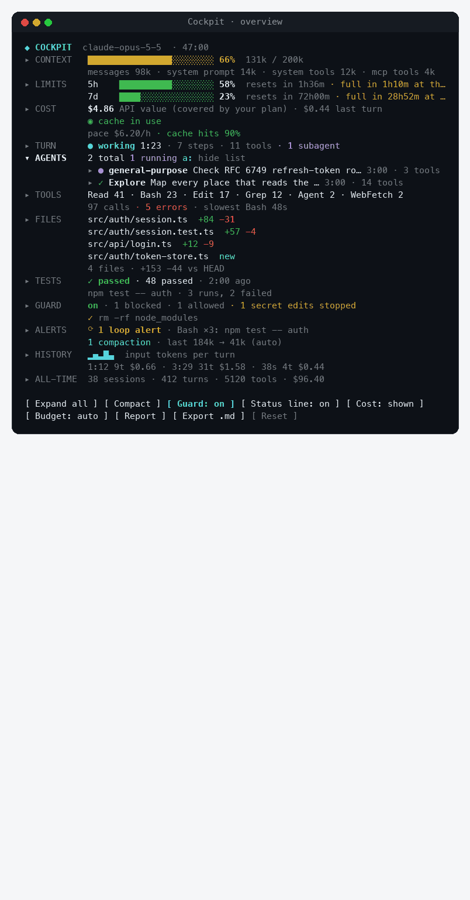
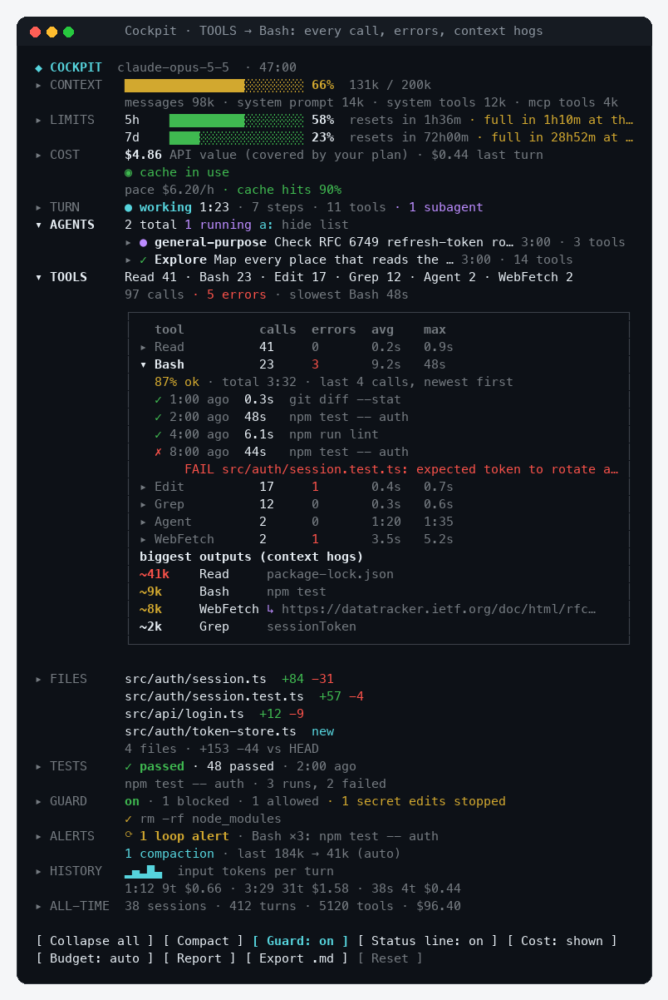
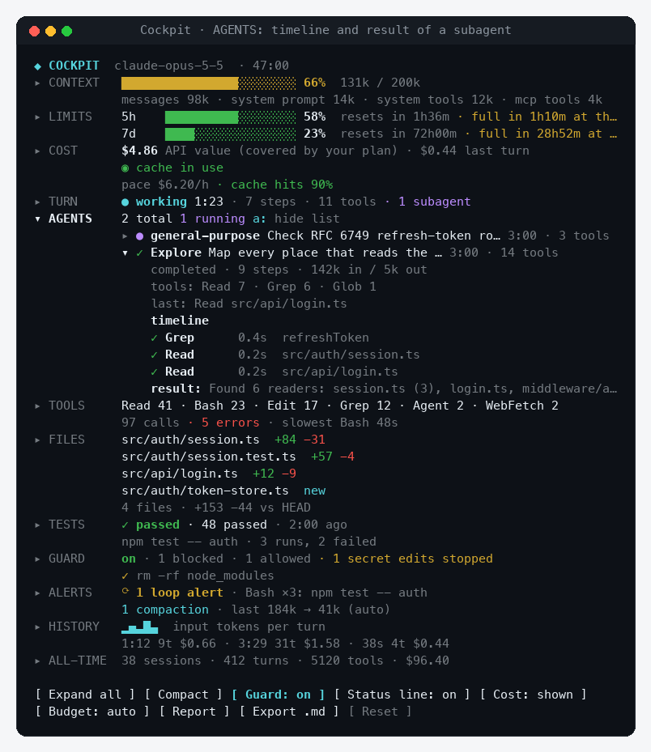
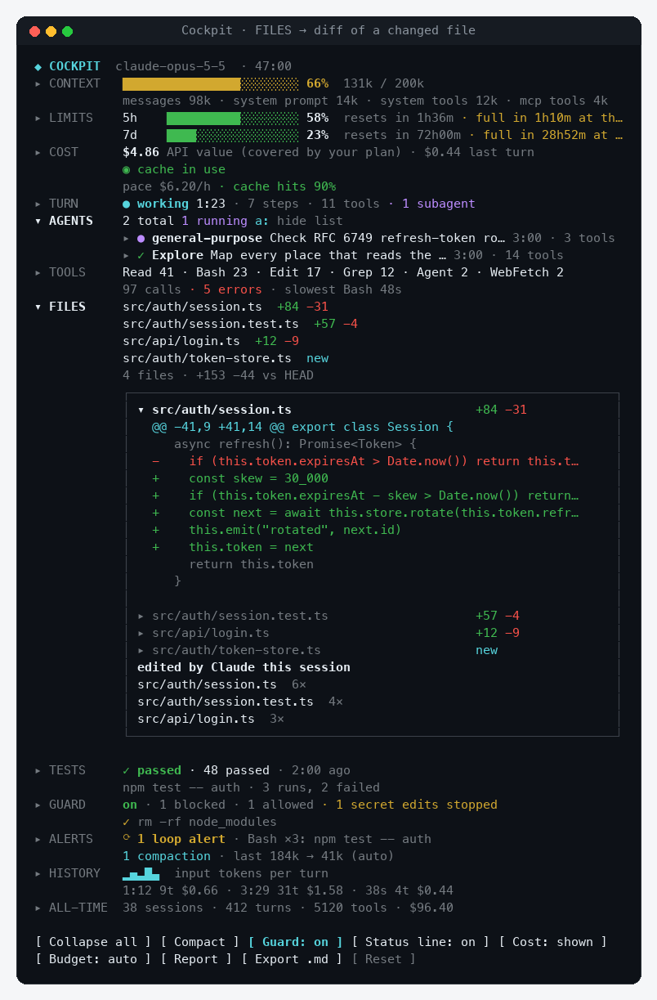
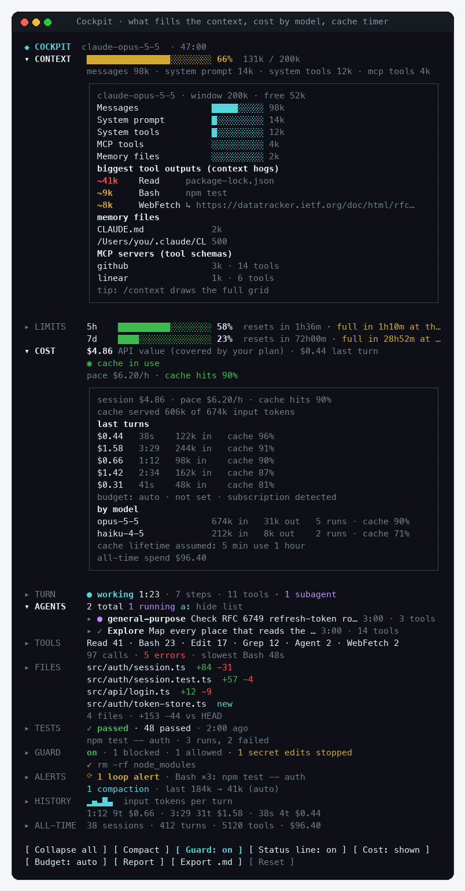
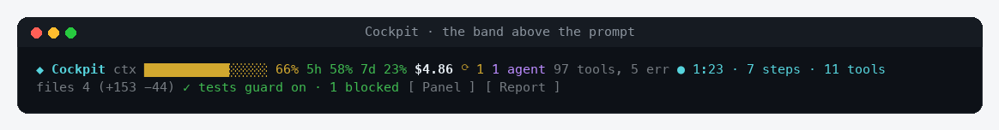

# Cockpit for Claude Code

**See what your agent is burning, doing and changing, live, without leaving the session.**

Cockpit is a [Claude Code mod](https://code.claude.com/docs/en/plugins/mods/overview): a panel beside the transcript with context fill, rate limits, cost, subagents, tool calls, changed files and test runs. Every section opens to the details. A guard asks you before `rm -rf`, a force push or an edit to `.env`.

**Works in** the Claude Code terminal and the **Claude desktop app** (Code tab). Tested on macOS.

[](LICENSE)




## Install

In Claude Code:

```
/plugin marketplace add drkokorev/cockpit-for-claude
/plugin install cockpit@cockpit-for-claude
```

Or from your shell:

```bash
claude plugin marketplace add drkokorev/cockpit-for-claude
claude plugin install cockpit@cockpit-for-claude
```

The panel opens on its own in a wide terminal; anywhere else, type `/cockpit`. To see every section filled in before a long session, run `/cockpit-demo` (and `/cockpit-demo off` to get your own numbers back).

## Why

A long agent session is a black box: you find out the context was full when Claude forgets something, that the 5-hour limit is gone when a request fails, and that a subagent looped on the same command when the bill arrives. Cockpit puts those numbers on screen while they still matter.

## What you see

| Section | At a glance | Open it for |
| --- | --- | --- |
| **Context** | Fill bar and tokens, what fills it | Every part of the context, memory files, MCP servers, the biggest tool outputs, and a **Compact now** button from 70% |
| **Limits** | 5-hour and 7-day windows, reset countdowns | Your pace per hour and when the window fills at that pace |
| **Cost** | Session and last-turn cost, spend per hour, cache hit rate, prompt-cache countdown | Cost per turn, tokens by model, budget settings |
| **Turn** | Live timer, model steps, tool calls, running subagents | The turn's last ten actions in order |
| **Agents** | Every subagent with its status | Steps, tokens, tool mix, a timeline of what it did, and its result |
| **Tools** | Most-used tools, errors, the slowest call | Calls, errors, average and max time per tool; open a tool for its recent calls and error messages |
| **Files** | Changed files vs `HEAD` with +/− lines | Open a file for its diff |
| **Tests** | Last run of npm/pnpm/yarn test, jest, vitest, pytest, go test, cargo test… | The last six runs with passed and failed counts |
| **Guard** | Blocked and allowed commands | The guard's log and what it watches |
| **Alerts** | Loop detector, compactions | Every alert with its time |
| **History** | Sparkline of input tokens per turn | A table of the last ten turns |
| **All-time** | Sessions, turns, tool calls, spend | Averages per session and per turn |

Where the app shows no side panel, a two-line band above the prompt carries the same live numbers, and a status line under the prompt reads like `◆ ctx 72% · 5h 31% · 14 tools` (with API billing it also shows the session cost, `$1.24`).

<details>
<summary><b>Screenshots</b></summary>

**Tools: every call of one tool, its errors, and the outputs that bloat the context**



**Agents: a subagent's timeline and result**



**Files: the diff of a changed file**



**Context and cost: what fills the window, tokens by model, cache countdown**



**The band above the prompt**



</details>

The pictures are rendered from the panel's real UI tree with the `/cockpit-demo` sample data (`media/` has the script).

## Alerts

Cockpit raises a toast when:

- the context is 80% and 95% full
- a rate-limit window is 75% and 90% used
- your budget is 80% and 100% spent (when a budget is set and shown)
- the same tool call repeats 3 times within 8 calls: a likely loop
- the context was compacted, with tokens before and after
- a turn took longer than two minutes

## Guard

Before Claude runs one of these, Cockpit stops and asks **Run it / Block it**:

`rm -rf` · `git push --force` · `git reset --hard` · `git clean -f` · `git checkout -- .` · `git branch -D` · `sudo` · `curl … | sh` · `DROP TABLE` / `TRUNCATE` · `chmod -R 777` · `mkfs` / `dd of=/dev/…` · `kubectl delete` · `terraform destroy` · `npm publish`

Edits to secrets files (`.env*`, `*.pem`, `*.key`, `id_rsa`, `credentials`, `secrets.json`…) get their own **Allow / Block it** question. A blocked call reaches Claude as a refusal that tells it to ask you first. Turn it off with `/cockpit-guard off`.

The guard is a seatbelt, not a sandbox: it matches command text, so treat it as a second look on top of Claude Code's own permissions.

## Commands

| Command | What it does |
| --- | --- |
| `/cockpit` | Open the panel (or print a report where no panel can be shown) |
| `/cockpit-report` | Print a session summary in the transcript |
| `/cockpit-export` | Save a Markdown report with every turn and tool to `.cockpit/cockpit-report.md` |
| `/cockpit-budget 5` · `on` · `off` · `auto` | Set a spend budget in USD, or choose when it shows (`auto`: with API billing, not on a subscription) |
| `/cockpit-guard on` · `off` | Turn the guard on or off |
| `/cockpit-cache 5` · `60` | The prompt-cache lifetime the countdown assumes, in minutes |
| `/cockpit-demo` · `off` | Fill the panel with sample data, or restore yours |

Everything in the panel is clickable: section names open details, tools and agents open their own, buttons at the bottom toggle the view. With the keyboard: `ctrl+x` then `tab` moves into the panel, `Tab` and `Enter` press buttons, and `x` expand all · `c` compact · `g` guard · `m` show or hide cost · `b` budget mode · `p` report · `e` export · `r` reset. `Esc` returns to the prompt.

## Privacy

Cockpit runs inside your Claude Code process and makes no network requests. It reads what the session already knows (usage, tool calls, subagents) and runs local `git` commands for the Files section. All-time totals stay in the plugin's local store; `/cockpit-export` writes only where you run it.

## Requirements

- Claude Code **v2.1.287 or later** (mods are on by default). Check with `claude --version`.
- The panel and band draw in the terminal (any size; the side panel docks from 110 columns in fullscreen) and in the Claude desktop app's Code tab. The regular chat tab of the desktop app does not load mods. In the VS Code chat panel, `claude -p` and cloud sessions, the guard and alerts still run; nothing is drawn.
- Rate-limit windows appear on a Pro or Max subscription; there the Cost section shows what the session would cost on the API, and the budget stays hidden unless you run `/cockpit-budget on`. With an API key, Cockpit shows the cost and budget everywhere.

## Develop

```bash
git clone https://github.com/drkokorev/cockpit-for-claude
cd cockpit-for-claude
claude plugin validate plugins/cockpit
claude plugin test plugins/cockpit
claude --plugin-dir plugins/cockpit
```

The mod is one hooks module, `plugins/cockpit/hooks/register.tsx`, with its state contract in `plugins/cockpit/types/index.d.ts`. Run `/plugin-types` in a session to get the engine's type declarations for your editor. Issues and pull requests are welcome.

## Roadmap

- Spend and turns per day for the last week
- Custom guard rules and thresholds in `/config`
- A sound when a long turn ends
- A team view that adds up usage across machines

## License

[MIT](LICENSE)
